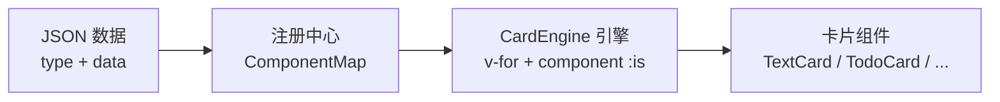

# Vue3-Adaptive-Card-Engine

> 数据驱动的自适应卡片渲染引擎 —— Data（{ type, data }）+ ComponentMap = UI

[](https://github.com/Achilles-Lang/Vue3-Adaptive-Card-Engine/actions/workflows/ci.yml)
[](https://www.npmjs.com/package/vue3-adaptive-card-engine)
[](./LICENSE)

---

## 核心理念

前端不写死任何具体的 UI 标签，而是维护一张「类型 → 组件」的映射表，根据数据包中的 `type` 字段，在运行时动态选择并渲染对应的业务组件。



---

## 演示预览

项目包含一个完整的交互式演示应用，支持自然语言输入、AI 驱动的卡片生成、混合组合展示。

> **🖼️ 截图占位 —— 演示主界面**
> *主题：暗色模式首页，左侧面板 + 右侧对话视图，尚未生成任何卡片*
> `<!-- TODO: 添加演示主界面截图 screenshots/demo-main-dark.png -->`

> **🖼️ 截图占位 —— 卡片组合展示**
> *主题：同时展示文本、图表、指标、清单和日程卡片的完整周报效果*
> `<!-- TODO: 添加卡片组合截图 screenshots/demo-cards-combo.png -->`

> **🖼️ 截图占位 —— 浅色主题**
> *主题：切换到浅色模式后的界面效果*
> `<!-- TODO: 添加浅色主题截图 screenshots/demo-light-mode.png -->`

---

## 目录

- [快速开始（NPM 安装）](#快速开始npm-安装)
- [演示项目运行](#演示项目运行)
- [API 文档](#api-文档)
- [卡片类型](#卡片类型)
- [本地开发](#本地开发)
- [改进方向](#改进方向)

---

## 快速开始（NPM 安装）

```bash
npm install vue3-adaptive-card-engine
```

```typescript
import { registerCards, CardEngine } from 'vue3-adaptive-card-engine';

// 1. 注册你的卡片
registerCards([
  { type: 'text', component: TextCard },
  { type: 'todo', component: TodoCard }
]);

// 2. 渲染
// <CardEngine :messages="messages" />
```

---

## 演示项目运行

演示项目位于 `examples/basic`，是一个独立的 Vue 3 应用，展示了引擎的全部能力。支持零依赖离线 Mock 模式，也可接入真实 AI 获取动态卡片。

### 环境要求

| 依赖 | 版本 |
|:---|:---|
| Node.js | >= 18 |
| pnpm | >= 8 |

### 快速启动（Mock 模式，无需 API Key）

```bash
# 1. 克隆仓库
git clone https://github.com/Achilles-Lang/Vue3-Adaptive-Card-Engine.git
cd Vue3-Adaptive-Card-Engine

# 2. 安装依赖
pnpm install

# 3. 启动演示应用
pnpm dev

# 4. 浏览器打开 http://localhost:5173
```

此时演示应用运行在离线 Mock 模式，所有卡片数据来自内置模拟引擎，无需任何 Key。

### 启用真实 AI（可选，推荐）

```bash
# 1. 复制配置文件
cp examples/basic/.env.example examples/basic/.env.local

# 2. 编辑 .env.local，填入 AI 提供商的 API Key
#    任选一个即可，推荐：

#    DeepSeek（国内友好，性价比高）
#    DEEPSEEK_API_KEY=sk-xxxxxxxxxxxxx

#    或 Gemini（免费额度）
#    GEMINI_API_KEY=xxxxxxxxxxxxx

#    或 OpenAI
#    OPENAI_API_KEY=sk-xxxxxxxxxxxxx

# 3. 重新启动
pnpm dev
```

配置成功后，左侧输入自然语言描述，AI 自动生成对应类型的卡片。顶栏会显示 `AI` 标签（Mock 模式显示 `Mock`）。

### 演示项目功能一览

| 功能 | 说明 |
|:---|:---|
| 🗣️ 自然语言输入 | 用自然语言描述需求，AI 自动选择最合适的卡片类型 |
| 🧩 卡片选择器 | AI 生成后勾选需要的卡片，多轮对话可混合组合 |
| 💬 对话视图 | 右侧展示完整对话上下文，卡片按消息分组 |
| 🔍 类型筛选 | 顶栏一键筛选：文本/清单/图表/指标/进度/日程/影像/代码/名片 |
| 📊 图表交互 | ChartCard 支持柱状图/折线图/面积图切换 + 悬浮数据提示 |
| 🌓 主题切换 | 右上角一键切换深色/浅色模式 |
| 📋 JSON 查看 | 点击 Canvas 列表中的卡片类型名查看完整数据模型 |
| 💾 持久化 | 自动保存到 localStorage，刷新不丢失 |
| 📦 生产构建 | `pnpm build` 构建静态站点，`pnpm preview` 预览 |

---

## 卡片类型

引擎内置 10 种卡片组件，分布在 `examples/basic/src/cards/`：

| 卡片 | 类型标识 | 说明 |
|:---|:---|:---|
| TextCard | `text` | Markdown 富文本，支持标题/加粗/代码/引用/列表 |
| TodoCard | `todo` | 可交互清单，带进度条 |
| ChartCard | `chart` | SVG 图表，bar/line/area 三模式切换 |
| MetricCard | `metric` | KPI 指标网格，趋势箭头 + 变化幅度 |
| ProgressCard | `progress` | 进度条，支持动画填充 |
| ScheduleCard | `schedule` | 垂直时间轴，带标签 |
| ImageCard | `image` | 图片展示 |
| CodeCard | `code` | 终端风格代码块 |
| ProfileCard | `profile` | 用户/项目名片 |
| SkeletonCard | *内部* | 加载态骨架屏 |

---

## 适用场景

- **AI 对话界面** —— AI 决定返回文本、进度还是图表
- **仪表盘 / 监控大屏** —— 后端告警级别决定展示形式
- **低代码表单渲染器** —— 根据 JSON Schema 动态渲染
- **消息通知中心** —— 根据消息类型渲染不同通知样式

---

## API 文档

### registerCard(type, component, resolver?)

注册单个卡片组件。

| 参数 | 类型 | 说明 |
|:---|:---|:---|
| `type` | `string` | 卡片类型标识 |
| `component` | `Component` | Vue 组件 |
| `resolver` | `(msg) => props` | 可选，自定义属性解析函数 |

### registerCards(entries)

批量注册卡片组件。

```typescript
registerCards([
  { type: 'text', component: TextCard },
  { type: 'todo', component: TodoCard, resolve: (msg) => ({ todos: msg.data.todos }) }
]);
```

### CardEngine

核心渲染组件。

| Props | 类型 | 说明 |
|:---|:---|:---|
| `messages` | `CardMessage[]` | 消息数组 |
| `fallback` | `Component` | 可选，自定义兜底组件 |

### CardMessage

消息数据契约。

```typescript
interface CardMessage<T extends string = string, D = unknown> {
  id: string | number;
  role: 'user' | 'assistant';
  type: T;
  data: D;
}
```

---

## 本地开发

```bash
# 安装依赖
pnpm install

# 启动演示
pnpm dev

# 类型检查
pnpm type-check

# 运行测试
pnpm test

# 构建
pnpm build
```

---

## 改进方向

以下是项目当前可优化的事项，按优先级排列：

### 🟡 代码层面

1. **CardEngine 透传 `type` prop 冲突** —— `CardEngine.vue` 的 `getProps` 方法对所有子组件注入 `type` 字段，可能与自定义组件的 `type` prop 冲突。建议仅对 FallbackCard 注入。
2. **TextCard 的 Markdown 解析器可独立封装** —— 当前在组件内用 `computed` 实现，功能完整但不够模块化。可抽为 `useMarkdown()` composable 或独立工具函数。
3. **Mock 引擎关键词匹配可改为 AI 辅助生成** —— 当前 5 个场景是硬编码的，可考虑让 LLM 预先批量生成 JSON 例句存入 mock 数据池。

### 🟢 工程层面

4. **GitHub Actions CI 可增加 E2E 测试** —— 当前只有类型检查 + 单元测试，可加入 Playwright 对演示页面做截图对比。
5. **`pnpm dev` 启动时自动检测 `.env.local` 并提示** —— 当前无任何提示，用户可能不知道卡在 Mock 模式。
6. **Template 分支同步脚本未在 CI 中自动化** —— `scripts/sync-template.sh` 可集成到 release workflow 中。
7. **`examples/basic` 的 AI 依赖可精简** —— `optionalDependencies` 中的 `@google/genai` / `@anthropic-ai/sdk` / `openai` 在实际使用 fetch 兜底时并非必需，可考虑完全移除 SDK 依赖，统一用 fetch。

### 🔵 产品层面

8. **Core 包可增加 `useCardEngine` composable** —— 配合 Vue 3 Composition API，让开发者用 `const { register, messages } = useCardEngine()|` 方式使用，体验更丝滑。
9. **卡片支持自定义排序/拖拽** —— Canvas 列表中的卡片目前按生成顺序排列，可加拖拽重排。
10. **增加 React / Svelte 版本的 Engine 核心** —— 架构不限于 Vue，可扩展到其他框架。

---

## License

MIT
