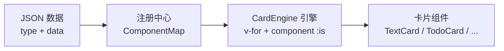

# Vue3-Adaptive-Card-Engine

> 数据驱动的自适应卡片渲染引擎 —— Data（{ type, data }）+ ComponentMap = UI

[](https://github.com/Achilles-Lang/Vue3-Adaptive-Card-Engine/actions/workflows/ci.yml)
[](https://www.npmjs.com/package/vue3-adaptive-card-engine)
[](./LICENSE)

---

## 核心理念

前端不写死任何具体的 UI 标签，而是维护一张「类型 → 组件」的映射表，根据数据包中的 `type` 字段，在运行时动态选择并渲染对应的业务组件。



---

## 快速开始

### NPM 安装

```bash
npm install vue3-adaptive-card-engine
```

```typescript
import { registerCards, CardEngine } from 'vue3-adaptive-card-engine';

// 1. 注册你的卡片
registerCards([
  { type: 'text', component: TextCard },
  { type: 'todo', component: TodoCard }
]);

// 2. 渲染
// <CardEngine :messages="messages" />
```

### 一键使用模板

通过 GitHub Template 一键创建项目：

1. 访问 [GitHub 仓库](https://github.com/Achilles-Lang/Vue3-Adaptive-Card-Engine)
2. 点击 "Use this template" → 选择 `template` 分支
3. 运行 `pnpm install && pnpm dev`

---

## 适用场景

- **AI 对话界面** —— AI 决定返回文本、进度还是图表
- **仪表盘 / 监控大屏** —— 后端告警级别决定展示形式
- **低代码表单渲染器** —— 根据 JSON Schema 动态渲染
- **消息通知中心** —— 根据消息类型渲染不同通知样式

---

## API 文档

### registerCard(type, component, resolver?)

注册单个卡片组件。

| 参数 | 类型 | 说明 |
|:---|:---|:---|
| `type` | `string` | 卡片类型标识 |
| `component` | `Component` | Vue 组件 |
| `resolver` | `(msg) => props` | 可选，自定义属性解析函数 |

### registerCards(entries)

批量注册卡片组件。

```typescript
registerCards([
  { type: 'text', component: TextCard },
  { type: 'todo', component: TodoCard, resolve: (msg) => ({ todos: msg.data.todos }) }
]);
```

### CardEngine

核心渲染组件。

| Props | 类型 | 说明 |
|:---|:---|:---|
| `messages` | `CardMessage[]` | 消息数组 |
| `fallback` | `Component` | 可选，自定义兜底组件 |

### CardMessage

消息数据契约。

```typescript
interface CardMessage<T extends string = string, D = unknown> {
  id: string | number;
  role: 'user' | 'assistant';
  type: T;
  data: D;
}
```

---

## 本地开发

```bash
# 安装依赖
pnpm install

# 启动示例
pnpm dev

# 类型检查
pnpm type-check

# 运行测试
pnpm test

# 构建
pnpm build
```

---

## License

MIT
